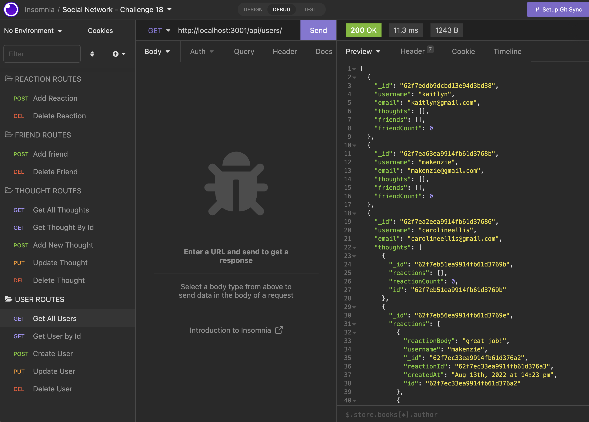

# Social Network API

## Table of Contents

- [User Story](#user-story)
- [Description](#description)
- [Usage](#usage)
- [Requirements](#requirements)
- [Application](#application)
- [Questions](#questions)

## User Story

- AS A social media startup
- I WANT an API for my social network that uses a NoSQL database
- SO THAT my website can handle large amounts of unstructured data

## Description

This is a social network web application where users can share their thoughts, react to friends’ thoughts, and create a friend list. This application uses Express.js for routing, a MongoDB database, and the Mongoose ODM.

## Usage

- Clone the repository into your directory
- Open the command line in this directory
- Install 'npm install'
- Invoke the command 'npm start' to start the server and the Mongo database
- Use insomnia to test the CRUD Operations on:
  - /api/users
  - /api/thoughts
  - /api/users/:userId/friends/:friendId
  - /api/thoughts/:thoughtId/reactions
  - /api/thoughts/:thoughtId/reactions/:reactionId

## Requirements

- GIVEN a social network API
- WHEN I enter the command to invoke the application
- THEN my server is started and the Mongoose models are synced to the MongoDB database
- WHEN I open API GET routes in Insomnia for users and thoughts
- THEN the data for each of these routes is displayed in a formatted JSON
- WHEN I test API POST, PUT, and DELETE routes in Insomnia
- THEN I am able to successfully create, update, and delete users and thoughts in my database
- WHEN I test API POST and DELETE routes in Insomnia
- THEN I am able to successfully create and delete reactions to thoughts and add and remove friends to a user’s friend list

## Application

Screenshot of Example Route in Insomnia

[Walkthrough Video](https://drive.google.com/file/d/12hbcaQ7YsnSkNfZavXGi5IzbyLJRJksP/view?usp=sharing)

## Questions?

For any questions, please email gilinamcbride@gmail.com, or visit any other projects on [Github](github.com/gilinamcbride).
